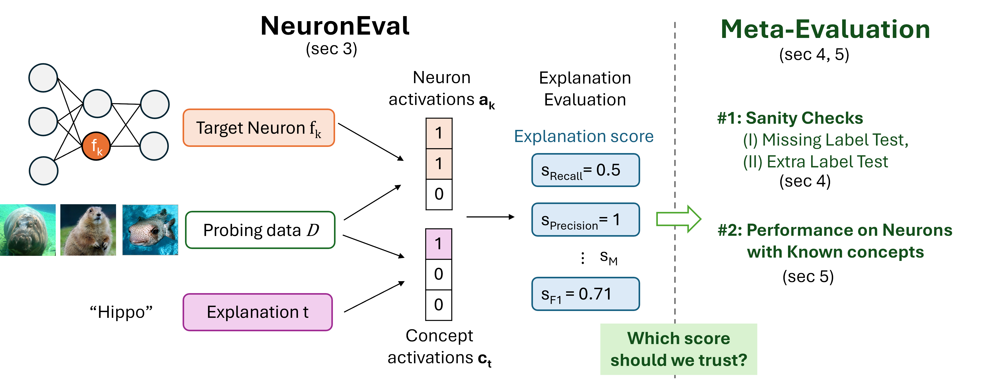

# Evaluating Neuron Explanations: A Unified Framework with Sanity Checks 

This is the official repo of our [ICML'25 paper](https://arxiv.org/abs/2506.05774), our full code will be released shortly, please stay tuned. [[Link to website]](https://lilywenglab.github.io/Neuron_Eval/)

* In this work we *unify* many existing neuron-level explanation evaluation methods under one mathematical framework: **Neuron Eval**.
* The unified framework **Neuron Eval** allows us to compare and contrast existing evaluation metrics, understand the evaluation pipeline with increased clarity and apply existing statistical concepts on the evaluation.
* In addition, we propose **two simple sanity tests** on the evaluation metrics and show that many commonly used metrics fail these tests. Our proposed tests served as necessary conditions for a reliable evaluation metric.
  




## Cite this work
T. Oikarinen, G. Yan, and T.-W. Weng, *Evaluating Neuron Explanations: A Unified Framework with Sanity Checks*, ICML 2025.

```
@inproceedings{oikarinen2025evaluating,
  title={Evaluating Neuron Explanations: A Unified Framework with Sanity Checks},
  author={Oikarinen, Tuomas and Yan, Ge and Weng, Tsui-Wei},
  booktitle={International Conference on Machine Learning},
  year={2025}
}
