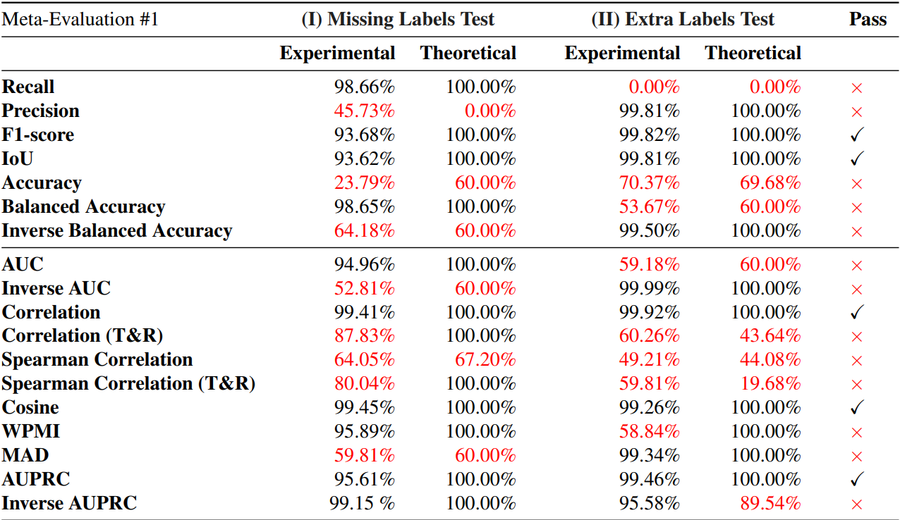

# Evaluating Neuron Explanations: A Unified Framework with Sanity Checks 

This is the official repo of our [ICML'25 paper](https://arxiv.org/abs/2506.05774), and our project website is at this [[link]](https://lilywenglab.github.io/Neuron_Eval/).

* In this work we *unify* many existing neuron-level explanation evaluation methods under one mathematical framework: **Neuron Eval**.
* The unified framework **Neuron Eval** allows us to compare and contrast existing evaluation metrics, understand the evaluation pipeline with increased clarity and apply existing statistical concepts on the evaluation.
* In addition, we propose **two simple sanity tests** on the evaluation metrics and show that many commonly used metrics fail these tests. Our proposed tests served as necessary conditions for a reliable evaluation metric.
  


## Setup

1. Install Python (3.11), PyTorch (tested with 2.0.1) and torchvision (0.15.2). Should also work with more recent versions.
    - [https://pytorch.org/get-started/locally/](https://pytorch.org/get-started/locally/)

2. Install other requirements
    - `pip install -r requirements.txt`

Downloading data and models (Required for some settings):
- ResNet-18 (Places365): `bash download_rn18_places.sh`
- CUB200 dataset: `bash download_cub.sh`(Linux) or `download_cub.bat`(Windows)
- CUB200 CBM model: `bash download_cub_cbm.sh`
- ImageNet (validation): We do not provide a download link, add link to your copy in `DATASET_ROOTS` under `data_utils.py`

## Quickstart

1. Theoretical Missing/Extra Labels Test (Sec. 4) - run `theoretical_sanity_check.ipynb`.
    - No downloads required
    - To test your own metric implement it under `metrics.py` and evaluate on a new line of `theoretical_sanity_check.ipynb`.
    - `activation_frequencies` determines what fraction of the inputs activate the simulated neuron/concept. Test will be run with each value in the list.

2. Experimental Missing/Extra Labels Test (Sec. 4) - run `experimental_sanity_check.ipynb`.
    - Test different settings (defined in F.1) by changing the `setting = ` parameter

3. Known Neuron AUPRC Test (Sec. 5) - run `known_neuron_auprc_eval.ipynb`.
    - Test different settings (defined in F.2) by changing the `setting = ` parameter

Main parameters: 
- `setting`: which test setup to use for experimental results, see Appendix F for details.
- `activations_dir`: Directory for saving neuron activations.
- `epsilon`: Minimal (normalized) decrease required for missing and extra labels test, default 0.001.


Additional experiments such as ablations can be found under `additional_experiments`.

## Results

- We find most existing evaluation metrics fail at least one of our simple sanity checks.
- Only *Correlation*, *Cosine similarity*, *AUPRC*, *F1-score* and *IoU* pass both sanity checks.



## Sources

- CUB model and processing: [ConceptBottleneck - GitHub](https://github.com/yewsiang/ConceptBottleneck)
- Overall code and data processing based on: [Linear-Explanations - GitHub](https://github.com/Trustworthy-ML-Lab/Linear-Explanations)
- Places365 models: [NetDissect-Lite](https://github.com/CSAILVision/NetDissect-Lite)


## Cite this work
T. Oikarinen, G. Yan, and T.-W. Weng, *Evaluating Neuron Explanations: A Unified Framework with Sanity Checks*, ICML 2025.

```
@inproceedings{oikarinen2025evaluating,
  title={Evaluating Neuron Explanations: A Unified Framework with Sanity Checks},
  author={Oikarinen, Tuomas and Yan, Ge and Weng, Tsui-Wei},
  booktitle={International Conference on Machine Learning},
  year={2025}
}
